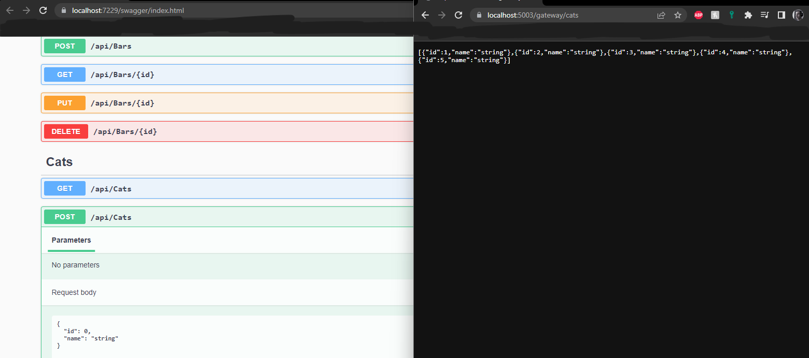

[](https://codefirst.iut.uca.fr/alexis.drai/cat_cafe)

[CI with SonarCloud](https://sonarcloud.io/summary/overall?id=draialexis_cat_cafe)

# Cat Café

## Global architecture

### Concept

This application attempts to modelize a cat café, with cafés (called "bars" here), cats, and customers.

### API REST

Those three entities can be persisted via a REST API. They can also be updated, queried, and removed. 

We used an ASP .NET Web API, with a Swagger configuration to visualize the interface.

### WebSocket

A websocket was set up to notify clients (who subscribe to it) whenever a Cat is `POST`ed. 

Clients need to subscribe by typing the following code in the console of their browser, in developer mode :

```js
new WebSocket("wss://localhost:5003/gateway/ws").onmessage = function (event) {
  if (event.data === "entity-created") {
    alert("A new entity was created!");
  }
};
```
*Note*: 
- while the app uses port `7229` in our default config, **you should use port `5003` anyway** to subscribe to our WebSocket through our *API Gateway*
- `"entity-created"` is a hard-coded event ID and should not be changed.
- you are free to change the content of the `Alert` itself, of course
### API Gateway

An [Ocelot](https://ocelot.readthedocs.io/en/latest/) API Gateway manages the whole system.

It can be started using Visual Studio if you first right-click the cat-cafe.sln Solution, and go to Properties.


Then set all relevant projects' "Action" to "Start", and they will all be launched simultaneously.


Now you can click "Start" to launch the "Multiple Startup Project".


And observe the API gateway in action.



Overall, the architecture may be summed up like so:


#### Ports 
| What | Where |
|--|--|
| REST API | https://localhost/7229 |
| API Gateway | https://localhost/5003 |
| WebSocket | ... |

#### Routes
The Gateway routes offer access to the REST API in a similar way as the REST API itself, with a small transformation: there is a new port, and the word "gateway" replaces "api". The REST API's Swagger UI will give you all the information required about those routes.

| REST(old) | Gateway(current) | 
|--|--|
| `GET` on `https://localhost/7229/api/cats` | `GET` on `https://localhost/5003/gateway/cats` |
| `POST` on `https://localhost/7229/api/bars/{id}` | `GET` on `https://localhost/5003/gateway/bars/{id}` |

...and for the websocket:
- old :
```js
new WebSocket("wss://localhost:7229/ws").onmessage = function (event) {...};
```

- new : 
```js
new WebSocket("wss://localhost:5003/gateway/ws").onmessage = function (event) {...};
```

#### Caching
The gateway uses caching to ensure that the entire list of customers is only queried from the database once every 10 seconds. The rest of the time, clients sending `GET`-all requests get served the contents of a cache. 
```json
    ...
    {
      "UpstreamPathTemplate": "/gateway/customers",
      "UpstreamHttpMethod": [ "Get" ],
      "DownstreamPathTemplate": "/api/customers",
      "DownstreamScheme": "https",
      "DownstreamHostAndPorts": [
        {
          "Host": "localhost",
          "Port": 7229
        }
      ],
      "FileCacheOptions": {
        "TtlSeconds": 10
      }
    } ...
```

#### Rate Limiting
The gateway uses rate limiting to make sure that clients cannot send an all-inclusive `GET`  on cats or on bars more than once per second.
```json
...
    {
      "UpstreamPathTemplate": "/gateway/bars",
      "UpstreamHttpMethod": [ "Get" ],
      "DownstreamPathTemplate": "/api/bars",
      "DownstreamScheme": "https",
      "DownstreamHostAndPorts": [
        {
          "Host": "localhost",
          "Port": 7229
        }
      ],
      "RateLimitOptions": {
        "EnableRateLimiting": true,
        "Period": "1s",
        "PeriodTimespan": 1,
        "Limit": 1
      }
    } ...
```
---
## To contribute (workflow)

We are using the feature branch workflow ([details here](https://www.atlassian.com/git/tutorials/comparing-workflows/feature-branch-workflow), or see the summary below)

### 1 - Sync with the remote

Make sure you're working with the latest version of the project

```bash
git checkout master
git fetch origin 
git reset --hard origin/master
```

### 2 - Create a new branch

Give your new branch a name referring to an issue (or maybe a group of similar issues)

```bash
git checkout -b branch-name-that-describes-the-new-feature
```

Regularly, you might want to get all the new code from your master branch (yeah, we forgot to rename it "main", sorry), to work with an up-to-date codebase:

```bash
git pull --rebase origin master
```

### 3 - Code

🔥🧑‍💻🐛🔥............✅

### 4 - Save your changes to your new branch

For a refresher, see details about  `add`,  `commit`,  `push`, etc.  [here](https://www.atlassian.com/git/tutorials/saving-changes)

It should involve creating a corresponding feature branch on the remote repository

```bash
git push -u origin branch-name-that-describes-the-new-feature
```

### [](https://codefirst.iut.uca.fr/git/alexis.drai/cat_cafe#5-create-a-pull-request)5 - Create a Pull Request

On  [the repository's main page](https://codefirst.iut.uca.fr/git/alexis.drai/dice_app), or on your new branch's master page, look for a  `New Pull Request`  button.

It should then allow you to  `merge into: ...:master`  and  `pull from: ...:new-feature`

Follow the platform's instructions, until you've made a "work in progress" (WIP) pull request. You can now assign reviewers among your colleagues. They will get familiar with your new code -- and will either accept the branch as it is, or help you arrange it.