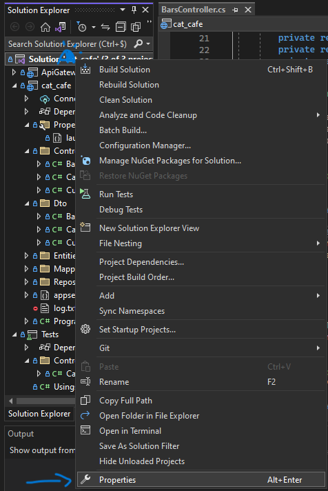
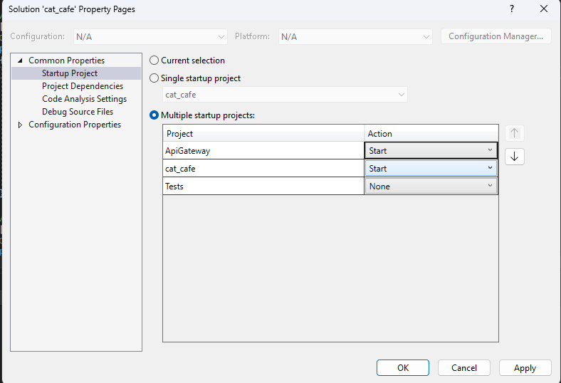
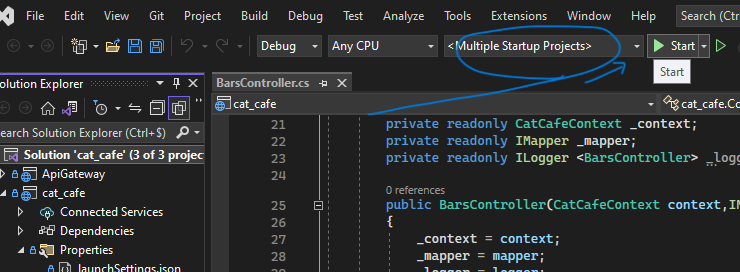
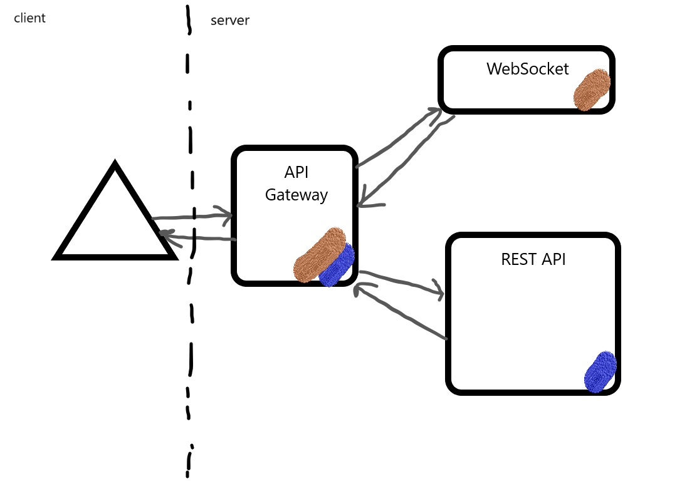

[](https://codefirst.iut.uca.fr/alexis.drai/cat_cafe)

[CI with SonarCloud](https://sonarcloud.io/summary/overall?id=draialexis_cat_cafe)

# Cat Café

## Table of Contents
* [REST API](#rest-api)
* [WebSocket](#websocket)
* [API type choices](#api-type-choices)
* [API Gateway](#api-gateway)
* [Versioning](#versioning)
* [Testing the app](#testing-the-app)

## Global architecture

---
### Concept

This application attempts to modelize a cat café, with cafés (called "bars" here), cats, and customers.

---
### REST API

Those three entities can be persisted via a REST API. They can also be updated, queried, and removed. 

We used an ASP .NET Web API, with a Swagger configuration to visualize the interface.

---
### WebSocket

A WebSocket was set up to notify clients (who subscribe to it) whenever a Cat is `POST`ed. 

Clients need to subscribe by typing the following code in the console of their browser, in developer mode :

```js
new WebSocket("wss://localhost:5003/gateway/ws").onmessage = function (event) {
  if (event.data === "entity-created") {
    alert("A new entity was created!");
  }
};
```
*Note*: 
- while the app uses port `7229` in our default config, **you should use port `5003` anyway** to subscribe to our WebSocket through our *API Gateway*
- `"entity-created"` is a hard-coded event ID and should not be changed.
- you are free to change the content of the `Alert` itself, of course

---
### API type choices

#### REST API 

REST APIs are scalable, standardized, loosely coupled with clients, stateless, and flexible.

Indeed, they can can easily handle multiple requests simultaneously, making them scalable for applications with increasing demands.
They use standard HTTP methods and return data in a format (JSON, XML, YAML, etc.) that can be easily consumed by a wide range of clients, including mobiles.

Besides, they can easily be cached and optimized for performance.

#### WebSocket

WebSockets provide real-time bi-directionnal communication, which is very useful for gaming, chat applications, or setting up notifications.
Said communication is not only bi-directionnal, but also full-duplex: clients and servers can send and receive data
simultaneously.

Since the connection is opened once and closed once, we avoid any performance loss linked to opening
and closing a connection for each request-response cycle. Similarly, a server that uses a websocket 
can reduce its load, because it is now pushing updates directly instead of being polled regularly by many clients. 

---
### API Gateway

#### How to launch both projects

An [Ocelot](https://ocelot.readthedocs.io/en/latest/) API Gateway manages the whole system.

It can be started using Visual Studio if you first right-click the cat-cafe.sln Solution, and go to Properties.



Then set all relevant projects' "Action" to "Start", and they will all be launched simultaneously.



Now you can click "Start" to launch the "Multiple Startup Project".



Then, the easiest way to try our API is to use Postman or an equivalent. Feel free to use Swagger UI, but it counteracts some of what our API does, with regards to versioning and using the Gateway.

---

Overall, the architecture may be summed up like so:




---

#### Ports 
| What | Where |
|--|--|
| REST API | https://localhost:7229 |
| API Gateway | https://localhost:5003 |
| WebSocket | ... |

#### Routes
The Gateway routes offer access to the REST API in a similar way as the REST API itself, with a small transformation: there is a new port, and the word "gateway" replaces "api". The REST API's Swagger UI will give you all the information required about those routes.

| REST(old) | Gateway(current) | 
|--|--|
| `GET` on `https://localhost:7229/api/cats` | `GET` on `https://localhost:5003/gateway/cats` |
| `DELETE` on `https://localhost:7229/api/bars/{id}` | `DELETE` on `https://localhost:5003/gateway/bars/{id}` |

...and for the websocket:
- old :
```js
new WebSocket("wss://localhost:7229/ws").onmessage = function (event) {...};
```

- new : 
```js
new WebSocket("wss://localhost:5003/gateway/ws").onmessage = function (event) {...};
```

#### Caching
The gateway uses caching to ensure that the entire list of customers is only queried from the database once every 10 seconds. The rest of the time, clients sending `GET`-all requests get served the contents of a cache. 
```json
    ...
    {
      "UpstreamPathTemplate": "/gateway/customers",
      "UpstreamHttpMethod": [ "Get" ],
      "DownstreamPathTemplate": "/api/customers",
      "DownstreamScheme": "https",
      "DownstreamHostAndPorts": [
        {
          "Host": "localhost",
          "Port": 7229
        }
      ],
      "FileCacheOptions": {
        "TtlSeconds": 10
      }
    } ...
```

#### Rate Limiting
The gateway uses rate limiting to make sure that clients cannot send an all-inclusive `GET`  on cats or on bars more than once per second.
```json
...
    {
      "UpstreamPathTemplate": "/gateway/bars",
      "UpstreamHttpMethod": [ "Get" ],
      "DownstreamPathTemplate": "/api/bars",
      "DownstreamScheme": "https",
      "DownstreamHostAndPorts": [
        {
          "Host": "localhost",
          "Port": 7229
        }
      ],
      "RateLimitOptions": {
        "EnableRateLimiting": true,
        "Period": "1s",
        "PeriodTimespan": 1,
        "Limit": 1
      }
    } ...
```

---
### Versioning

This API is versioned, but our clients do not need to know about it. 
We use URIs to implement our versioning, but our clients do not need to rewrite their requests to stay up-to-date.
That is all thanks to our API Gateway, which masks these details:

```json
   ...
   {
      "UpstreamPathTemplate": "/gateway/cats",
      "UpstreamHttpMethod": [ "Get" ],
      "DownstreamPathTemplate": "/api/v2/cats",
      ...
    },
    {
      "UpstreamPathTemplate": "/gateway/cats",
      "UpstreamHttpMethod": [ "Post" ],
      "DownstreamPathTemplate": "/api/v1/cats",
      ...
    },
    ...
```

---
## Testing the app

0. Prepare to use Postman
1. Start both the `cat_cafe` and `ApiGateway` projects (you may refer to [this procedure](#how-to-launch-both-projects)). Two browser windows will open, but *you can ignore SwaggerUI*.
2. Use a browser window to open a WebSocket, so that you will get notifications (you may refer to [that procedure](#websocket))
3. In Postman, inside a workspace, click the `Import` button in the top left corner. Then click `Choose files` and find the collection to import in `docs/cat_cafe.postman_collection.json`, in this repo. Follow the procedure to save it.
4. Keep an eye on the browser window that you used to open a WebSocket, and execute the requests in this imported collection. When using `POST`, you should get an alert in the browser window.

Notice that the REST API and the WebSocket are accessed through our API Gateway. 

In a real-life scenario, we could use IP-blocking or firewalls to ensure that port 7229 can only be accessed by the app itself and the gateway. 

---
## To contribute (workflow)

We are using the feature branch workflow ([details here](https://www.atlassian.com/git/tutorials/comparing-workflows/feature-branch-workflow), or see the summary below)

### 1 - Sync with the remote

Make sure you're working with the latest version of the project

```bash
git checkout master
git fetch origin 
git reset --hard origin/master
```

### 2 - Create a new branch

Give your new branch a name referring to an issue (or maybe a group of similar issues)

```bash
git checkout -b branch-name-that-describes-the-new-feature
```

Regularly, you might want to get all the new code from your master branch (yeah, we forgot to rename it "main", sorry), to work with an up-to-date codebase:

```bash
git pull --rebase origin master
```

### 3 - Code

🔥🧑‍💻🐛🔥............✅

### 4 - Save your changes to your new branch

For a refresher, see details about  `add`,  `commit`,  `push`, etc.  [here](https://www.atlassian.com/git/tutorials/saving-changes)

It should involve creating a corresponding feature branch on the remote repository

```bash
git push -u origin branch-name-that-describes-the-new-feature
```

### [](https://codefirst.iut.uca.fr/git/alexis.drai/cat_cafe#5-create-a-pull-request)5 - Create a Pull Request

On  [the repository's main page](https://codefirst.iut.uca.fr/git/alexis.drai/dice_app), or on your new branch's master page, look for a  `New Pull Request`  button.

It should then allow you to  `merge into: ...:master`  and  `pull from: ...:new-feature`

Follow the platform's instructions, until you've made a "work in progress" (WIP) pull request. You can now assign reviewers among your colleagues. They will get familiar with your new code -- and will either accept the branch as it is, or help you arrange it.